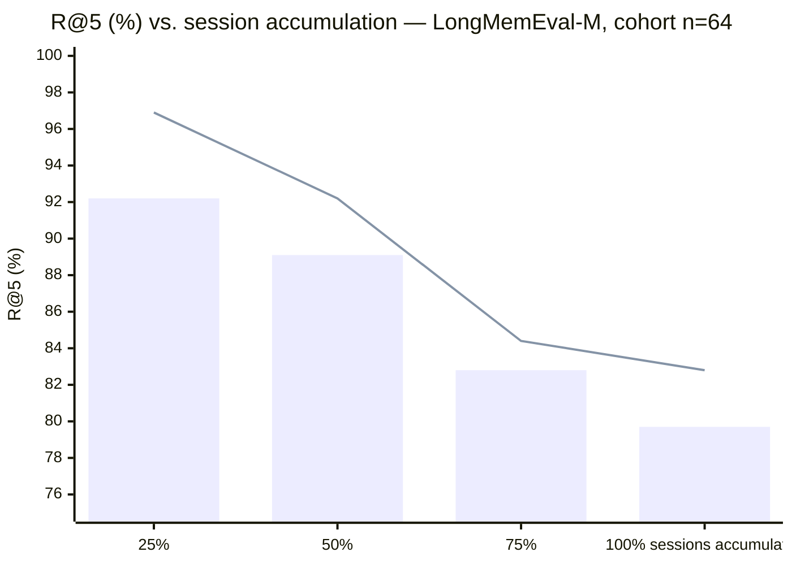
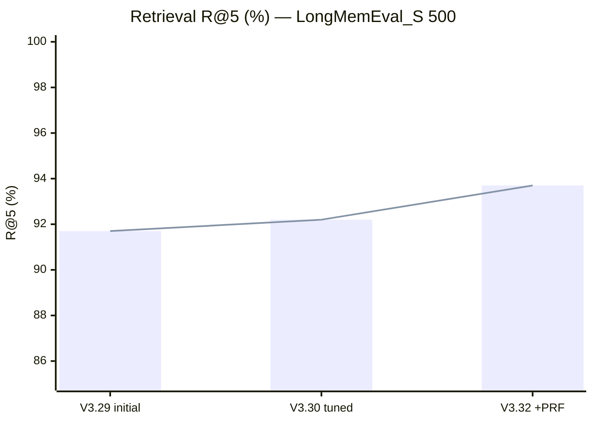
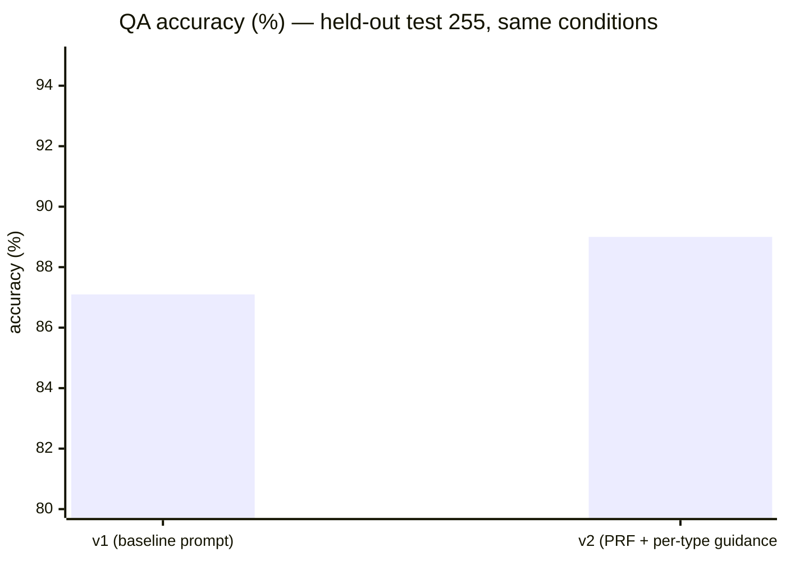
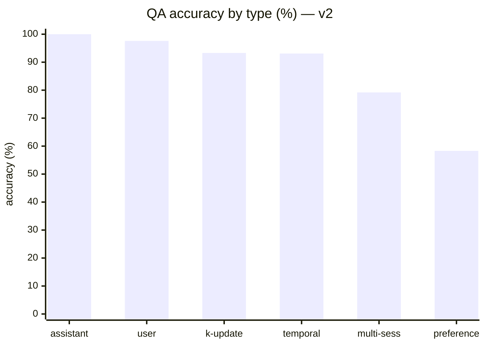
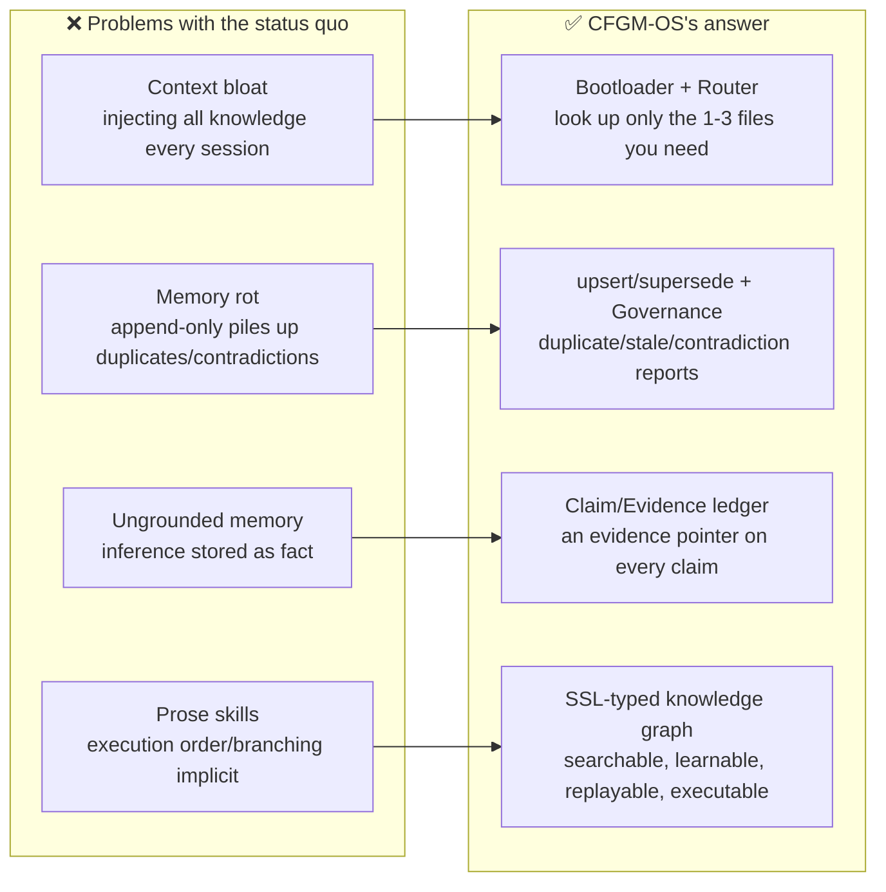
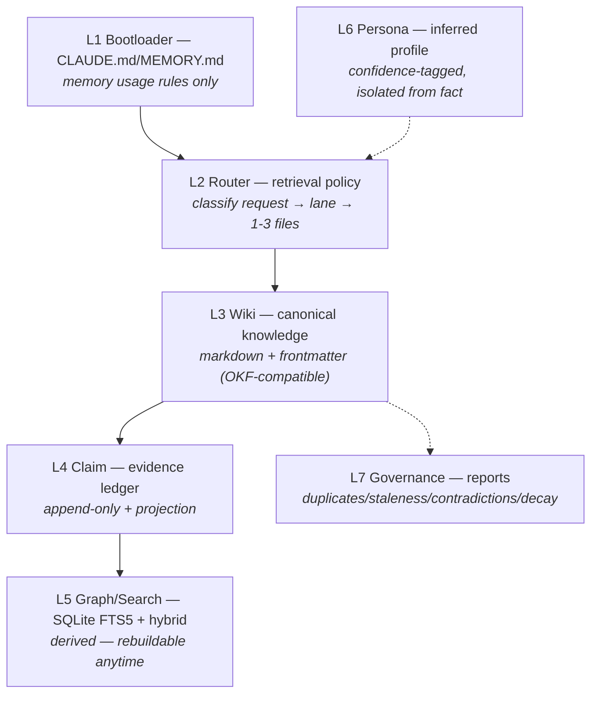
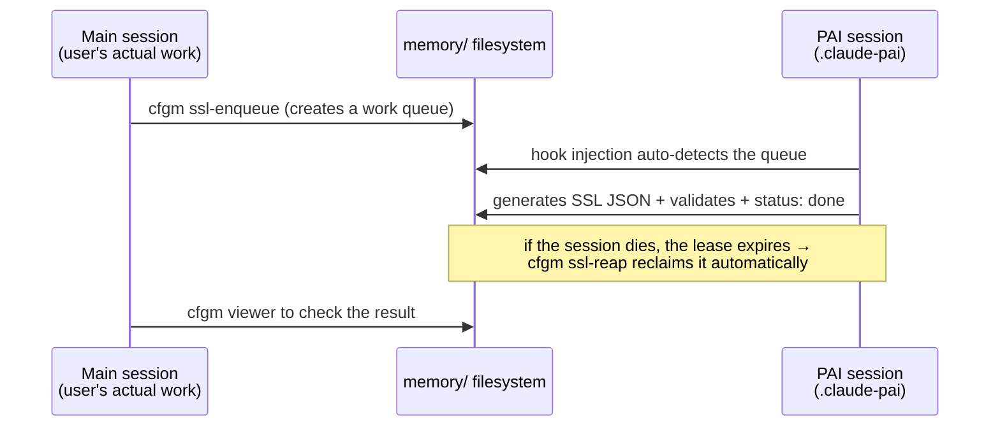

🇰🇷 [한국어 (기본)](./README.md)

# CFGM-OS (memory-brain)

> **CFGM-OS (memory-brain)** — Claim-grounded, persona-aware memory routing OS for host CLIs (Claude Code, Codex). No server. No API key. No MCP. Your memory is markdown in your repo.

    [](https://github.com/treestar84/memory-brain/actions/workflows/ci.yml)


Designed to be host-agnostic: the on-disk memory (`memory/`) and the `cfgm` CLI work alongside any host CLI — e.g. Codex reads `AGENTS.md` at session start and follows the same rules. Automatic hook capture (session-persistent memory without manual `cfgm` calls) is currently Claude Code only. No MCP server, no API key, no extra subscription — the only interfaces are files and natural-language specs.

---

## ⚡ Memory rot, measured



Retrieval quality collapses 12–14pp as sessions pile up — we measured it on LongMemEval-M (2.5GB, cohort-controlled, zero LLM calls), published the methodology, **and the rejection log of our own failed fix**. In a market of 90%+ marketing numbers, we ship our negative results.

```bash
cfgm rot-bench -- --cohort
```

Full methodology, checkpoint tables, and threats to validity: [`docs/BENCHMARK.md`](./docs/BENCHMARK.md) · [`memory/reports/rot-bench-cohort-latest.md`](./memory/reports/rot-bench-cohort-latest.md).

---

## ⚡ 30-second demo — a new session remembers a past decision

```
# ❌ A typical new session
> Why did we back out of the Honcho self-host?
"No prior conversation history to check. Generally speaking..." (starts guessing)
```

```bash
$ CFGM_LANG=en cfgm ask "why did we reverse the Honcho self-host decision"
Query: "why did we reverse the Honcho self-host decision" — 1 ground(s)

● decision.oss-incorporation  [decision/active]
  decisions/oss-incorporation.md
  ...Honcho server 통째 self-host 결정은 ADR-021 으로 철회. ...
  claims: cl-oss-001, cl-oss-002, cl-oss-003, cl-oss-004, cl-oss-005, cl-oss-006

Answer using only the grounds above. Cite (source: <pageId> / <claim-id>) after
each statement. If the grounds are insufficient, reply 'no grounds in memory'
— do not guess. Question: why did we reverse the Honcho self-host decision

--- grounds bundle ~139 tokens · 3.6% of total memory ~3913 tokens (estimate: chars/4)
```

> "We backed out of self-hosting Honcho because the docker-compose + Postgres+pgvector + LLM API key burden conflicted with the local-first philosophy, and replaced it with our own PersonaStore (markdown + jsonl) **(source: decision.oss-incorporation / cl-oss-004)**"

The snippet above is in Korean because this repo dogfoods its own (Korean) memory — the engine is language-agnostic, and `CFGM_LANG=en` switches all CLI messages to English.

Zero extra LLM API calls anywhere in this flow — the answer is generated by the host CLI subscription you're already paying for.

## 🎯 What changes: three scenarios

### Scenario 1 — decisions and their reasons survive a session change

*"Last week's session scoped and justified an OSS adoption decision. Today's session has no idea."*

```bash
$ CFGM_LANG=en cfgm ask "OSS incorporation policy decision"
Query: "OSS incorporation policy decision" — 1 ground(s)

● decision.oss-incorporation  [decision/active]
  decisions/oss-incorporation.md
  claims: cl-oss-001, cl-oss-002, cl-oss-003, cl-oss-004, cl-oss-005, cl-oss-006
```

→ Effect: not just the decision itself but all 6 supporting claims come back with it — the "why" doesn't disappear across sessions.

### Scenario 2 — "where did that come from?" answered at claim granularity

Every fragment of memory carries a claim id marker. Excerpt from the actual wiki page source (`memory/decisions/oss-incorporation.md` — original is in Korean, translation below):

```markdown
<!-- claim:cl-oss-004 -->
**L6 Persona**: Honcho self-host 부담(docker-compose + Postgres+pgvector + LLM API key)
이 사용자 local-first 정신과 충돌하여 철회. 자체 PersonaStore (markdown + jsonl, ...) 로 대체.
```

*Translation: "Backed out of the Honcho self-host burden (docker-compose + Postgres+pgvector + LLM API key) because it conflicted with the local-first philosophy. Replaced with our own PersonaStore (markdown + jsonl)."*

→ Effect: every claim in an answer traces back to this marker — when there's no evidence, the model is instructed to say "no evidence in memory" instead of guessing.

### Scenario 3 — my memory is a markdown file I can open myself

*"If I can't open a memory tool and see, or fix, what it thinks it knows — that's not my memory."*

```
$ git log --oneline -3 -- memory/decisions/ memory/concepts/
6caf99d feat(kg): app-store-screenshots SSL — 7개 logical 노드 instructions 채움
7f99f2b feat(kg): app-store-screenshots SSL 편입 + KGProjector evidenceClaimIds fix
d3622ba feat(tbox): TBox 확장 — capabilities.yaml + scopes.yaml
```

*(Real commit history — messages are in Korean because this repo dogfoods its own memory.)*

→ Effect: memory is markdown in the repo, not a vector DB or a cloud black box — unlike memory trapped in a DB or cloud service, you can read it directly, fix it, review it as a diff, and roll it back with git. Zero vendor lock-in, and you can share memory with a team via PR.

---

## 📊 Benchmark scorecard

Measured on the credible, external **[LongMemEval](https://github.com/xiaowu0162/LongMemEval)** benchmark (ICLR 2025). All numbers follow the [measurement protocol](./docs/BENCHMARK.md) and are reproducible with the commands below.

### Headline numbers

| Track | Setting | Score |
|---|---|---|
| 🔍 **Retrieval R@5** | held-out test 255, 0 LLM calls | **93.2%** |
| 🔍 Retrieval R@10 / MRR | full 500 | **96.5%** / 0.928 |
| 🧠 **QA accuracy** | held-out test 255, Sonnet + LLM judge | **89.0%** |

### Improvement over versions





### QA by question type (v1 → v2, held-out test)



| Type | v1 | **v2** | Δ |
|---|---|---|---|
| single-session-assistant | 100% | **100%** | — |
| single-session-user | 97.6% | **97.6%** | — |
| knowledge-update | 93.3% | **93.3%** | — |
| temporal-reasoning | 87.5% | **93.1%** | 🔺 **+5.6pp** |
| multi-session | 77.8% | **79.2%** | 🔺 +1.4pp |
| single-session-preference (n=12) | 58.3% | 58.3% | — <sub>small-sample, unproven</sub> |

### Why you can trust these numbers

| Safeguard | Detail |
|---|---|
| Held-out split | dev 245 (tuning only) / test 255 (confirmed once) — deterministic hash split, blocks overfitting |
| Data integrity | dataset SHA-256 published — refutable against tampering or version drift |
| Full tuning log published | **rejected techniques recorded too** (turn-level: dev -3.1pp → rejected) |
| No benchmark overfitting | policy against constants back-derived from answers (e.g. hypernym dictionaries) |
| Same-conditions comparison | v1/v2 compared only on the same split with the same judge protocol |
| Limitations disclosed upfront | judge is self-run, single run, small-sample types, etc. — see [threats to validity](./docs/BENCHMARK.md#7-알려진-한계-threats-to-validity) |

### Reproduce

```bash
git clone https://github.com/treestar84/memory-brain.git && cd memory-brain && bun install
mkdir -p data/longmemeval && cd data/longmemeval
curl -LO https://huggingface.co/datasets/xiaowu0162/longmemeval-cleaned/resolve/main/longmemeval_s_cleaned.json
shasum -a 256 longmemeval_s_cleaned.json   # compare against the SHA-256 in docs/BENCHMARK.md
cd ../.. && bun run bench:lme -- --split test --prf   # reproduces the confirmed retrieval numbers (0 LLM calls)
```

### Stability — validated with a long-running simulation, not just unit tests

1279+ unit/integration tests pass, but that alone can't catch what only shows up under sustained, realistic use — so a 39-session "vibe coding" simulation was run end-to-end: install → early feature work → real bugs hit and fixed (a route-ordering 404, a `db.transaction()` race condition, a rate-limiter memory leak) → a long 18-turn session that triggers context compaction → 30 more sessions of accumulated daily use (mixing in the tool types that actually get queued for capture) → importing a real past Claude Code transcript → cross-machine sync in both directions (a second clone pushes, the first pulls, checked for `.gitattributes` conflict markers) → two concurrent sessions ending at once → uninstall with data preserved. It drove the actual hook scripts with the same JSON shape Claude Code sends on the wire (not hand-written fixtures) and confirmed decisions written in early sessions were retrieved by keyword and by claim id dozens of sessions later, with no data loss, no sync conflicts, and no concurrency errors. This is a synthetic scenario, not a substitute for real multi-user usage — but it's the closest thing to real usage this project could self-verify before a public launch, and it directly caught the fix below.

**Found and fixed by that process**: the adapter that turns Claude Code's hook payloads into internal events had been matching the wrong JSON field name since the earliest version — real Claude Code sends `hook_event_name`, not `type` (confirmed against the official hook docs). Every hook invocation was silently failing and swallowed by an error-logging catch-all, so session memory was never actually being captured in practice, even though every test passed (the test fixtures had been authored against the same wrong assumption). Fixed with the real field names as primary and the old ones kept only as a compatibility fallback — see `CHANGELOG.md` for the full account, including the production evidence that surfaced it.

---

## 🆚 vs Competitors

Same category axes used across the memory-tool ecosystem's own comparisons (retrieval accuracy, auto-capture, search stack, multi-agent, external deps, lifecycle, token cost, viewer, self-hosted) — extended to match the granularity of [agentmemory's own feature matrix](https://github.com/rohitg00/agentmemory/blob/main/benchmark/COMPARISON.md), which breaks "lifecycle" into decay/consolidation/versioning and adds knowledge-graph, privacy, export, cross-agent, audit-trail, and SDK rows. Licenses/stars independently checked via the GitHub API where the repo is public; unverifiable entries are marked. memory-brain's own cells below are verified against this repo's source, not asserted — file:line pointers are in the row notes where it matters.

| | **memory-brain** | agentmemory (25.8K★) | mem0 (61.7K★) | Letta/MemGPT (24.0K★) | Khoj (36.0K★) | supermemory (28.6K★) | MemPalace (57.8K★) | oracleagentmemory | Hippo | Built-in (CLAUDE.md) |
|---|---|---|---|---|---|---|---|---|---|---|
| **GitHub stars** | Pre-launch (repo currently private, no public release yet) | Growing | 58K+ | 23K+ | 35K+ | 26K+ | 54K+ | PyPI (Oracle) | Trending | N/A |
| **Type** | Memory engine — file-based, no server | Memory engine + MCP server | Memory layer API | Full agent runtime | Personal AI | Memory API + app | Vector memory (OSS) | Memory engine (Oracle DB) | Memory system | Static file |
| **Retrieval R@5** | **93.2%** (LongMemEval-S, measured) | 95.2% (measured) | 68.5% (LoCoMo — different dataset) | 83.2% (LoCoMo) | N/A | Self-reported | ~96.6% (self-reported, unverified) | 94.4% (self-reported, unverified) | N/A | N/A (grep) |
| **Auto-capture** | Session-end auto-enqueue → host-LLM draft → 1 human approval (no direct LLM API call, ever) | 12 hooks, zero manual effort | Manual `add()` calls | Agent self-edits | Manual | API-side extraction | Manual | API extraction | Manual | Manual editing |
| **Search** | BM25 (FTS5) + Vector, RRF/rescue fusion — no graph stream | BM25 + Vector + Graph, RRF | Vector + Graph | Vector (archival) | Semantic | Vector + RAG | Vector-only | Vector + semantic | Decay-weighted | Loads everything into context |
| **Knowledge graph** | SSL-skill execution graph only (`src/core/search/KGProjector.ts` — scheduling→structural→logical typed nodes over `.claude/skills/`); no general memory/entity graph, doesn't feed wiki/session retrieval | ✅ Entity extraction + BFS | ✅ Mem0g variant | ❌ | Doc links | ❌ | ❌ | ❌ | ❌ | ❌ |
| **Multi-agent** | **None** (single-session, single-user by design) | MCP + REST + leases + signals | API (no coordination) | Within Letta runtime only | No | No | No | Scoped only | Multi-agent shared | Per-agent files |
| **Cross-agent access** | Any CLI that can shell out to `cfgm`, or just read the markdown directly — no MCP/protocol required (but single-session by design, see Multi-agent row) | ✅ MCP + REST | API calls | Within runtime | Standalone | MCP + API | Standalone | Python API | Multi-agent shared | Per-agent files |
| **Framework lock-in** | **None** — plain markdown + SQLite, no MCP server required (any coding CLI can shell out to `cfgm`) | None (any MCP client) | None (library you call from your own code) | **High** — must run inside the Letta runtime/cloud | Standalone (Khoj *is* the assistant, not a layer you embed) | None | None | **High** — requires Oracle Database | None (unverified — no independently discoverable public repo, see note below) | Per-agent format (whatever convention that agent's file loader expects) |
| **External deps** | **None** — Bun + 1 npm package (`yaml`) | "None" claimed, but requires `iii-engine` (separate Rust binary, license `Apache-2.0 AND Elastic-2.0`) | Qdrant / pgvector | Postgres + vector DB | Multiple | Managed cloud | Vector store | Oracle AI Database (enterprise) | None | None |
| **Memory decay** | Yes — age × recall-frequency scoring (`cfgm decay`, `src/core/governance/WikiDecayEngine.ts`), archive-gated, **never deletes** | ✅ Ebbinghaus + tiered | ❌ | ❌ | ❌ | ✅ Auto-forget | ❌ | ❌ | ✅ Half-lives | Manual pruning |
| **Consolidation tiers** | No fixed tiers — single human-gated promotion pipeline (`cfgm capture` → draft → 1 approval → canonical page, `src/core/capture/CaptureAccepter.ts`) | ✅ Working→episodic→semantic→procedural | ❌ | OS-inspired tiers | ❌ | ❌ | ❌ | ❌ | Episodic + semantic | ❌ |
| **Version / supersession** | Yes — `--force` archives the superseded page to `_archive/` before writing the new one (git-diffable, `CaptureAccepter.ts:97-111`); duplicates/contradictions are flagged for human review, not auto-merged (`src/core/governance/reports/DuplicateCandidatesDetector.ts`) | ✅ Jaccard-based | Passive | ❌ | ❌ | ✅ Auto-resolve | ❌ | ❌ | ❌ | ❌ |
| **Token cost** | **~184 tokens/query** (measured live), **$0/yr structurally** (no LLM-call code path exists) | ~1,900 tokens/session, ~$10/yr | Varies by integration | Core memory in context | Varies | Cloud pricing | No token budget | LLM-backed (varies) | Varies | 22K+ tokens at 240 obs |
| **Privacy filtering** | Yes — regex secret redaction (Anthropic/OpenAI/AWS keys, JWTs, password/secret fields — `src/core/security/patterns.ts`) runs at `cfgm capture-accept`, the last point before a page becomes git-tracked (`src/core/capture/CaptureAccepter.ts`), plus separately on the flow-graph observation pipeline (`src/hooks/bootstrap.ts:153`). Fixed 2026-07-30 — it previously covered only the latter, not the actual wiki-capture path | ✅ Strips secrets pre-store | ❌ | ❌ | ❌ | ❌ | ❌ | ❌ | ❌ | ❌ |
| **Obsidian / vault export** | No export step needed — `memory/` is already a plain markdown + YAML-frontmatter folder tree, opens natively as an Obsidian vault (Google OKF v0.1 export also available via `cfgm okf-export`) | ✅ Built-in | ❌ | ❌ | Native format | ❌ | ❌ | ❌ | ❌ | Already markdown, but no frontmatter schema |
| **Audit trail** | Yes, two layers — append-only hashed observation ledger (`src/core/ledger/RawLedger.ts`) + wiki pages are git-tracked markdown (full diffable history, revertable) | ✅ All mutations logged | ❌ | Limited | ❌ | ❌ | ❌ | ❌ | ❌ | Git history, if the file happens to be in a repo |
| **Language SDKs** | None — single Bun/TypeScript CLI (`cfgm`), invoked via shell exec from any language or agent | Any (REST + MCP) | Python + TS | Python only | API | Python + TS | Python | Python only | Node | N/A |
| **Real-time viewer** | **Yes** — `cfgm dashboard` (localhost:4040, local-only, no cloud) | Yes (port 3113) | Cloud dashboard | Cloud dashboard | Web UI | Cloud dashboard | No | No | No | No |
| **Self-hosted** | Yes — the only option, no cloud variant exists | Yes (default); paid one-click cloud templates also offered | Optional | Optional | Yes | Repo says "runs fully locally" — conflicts with some vendor claims of cloud-only, not independently confirmed either way | Yes | Yes (Oracle DB) | Yes | Yes |

**What we verified vs what we didn't.** mem0 / Letta / Khoj / supermemory / MemPalace license + star counts are pulled live from the GitHub API, not copied from anyone's marketing page. `oracleagentmemory` and `Hippo` have no independently discoverable public repo as of this writing — those two rows are carried over from other vendors' comparison tables and should be treated as unverified. Star counts drift; this table was last checked 2026-07. LoCoMo and LongMemEval are different datasets — the R@5 column is directional, not a controlled head-to-head, except between memory-brain and agentmemory (both LongMemEval-S). For the ten rows added in this pass (GitHub stars, Knowledge graph, Cross-agent access, Memory decay, Consolidation tiers, Version/supersession, Privacy filtering, Obsidian/vault export, Audit trail, Language SDKs), the other eight tools' cells are carried over verbatim from agentmemory's own [`benchmark/COMPARISON.md`](https://github.com/rohitg00/agentmemory/blob/main/benchmark/COMPARISON.md) — we have not independently reproduced those vendors' claims; only memory-brain's own cells in this table were freshly verified against this repo's source in this pass.

**Where memory-brain trails, honestly**: retrieval R@5 is 2pp behind agentmemory's on the same benchmark family — this is a structural gap (aggregation-style multi-session questions exceed retrieval depth, and the zero-dependency hashed n-gram embedder can't catch synonym/hypernym matches the way a real embedding model or benchmark-derived dictionary could) that we've chosen not to close by giving up the zero-LLM-call, zero-external-dep design; search has no general-purpose knowledge graph (only a skill-execution one); there are no consolidation tiers, just one human-gated promotion step; no SDK, only a CLI; multi-agent coordination doesn't exist by design. These are open items, not silently ignored — see [`docs/RULES.md`](./docs/RULES.md) for the design principles that make some of these deliberate trade-offs rather than oversights (no MCP, no direct LLM API calls, delete-never).

**Does it stay usable as markdown files pile up?** That's exactly what the "Memory rot, measured" chart at the top of this document answers: naive (append-only) retrieval drops from 92.2% to 79.7% R@5 as sessions accumulate to 100%, while memory-brain's governed retrieval drops from 96.9% to 82.8% — worse at every checkpoint for naive, and neither claims to stay flat. See [`docs/ROT-BENCH.md`](./docs/ROT-BENCH.md) for the full methodology.

---

## 🧩 Why: four pain points

- **Context bloat** — cramming all knowledge into CLAUDE.md every session burns tokens and focus.
- **Memory rot** — append-only accumulation piles up duplicates and contradictions until you can't tell what's current.
- **Ungrounded memory** — something inferred once gets cited as verified fact in the next session.
- **Implicit prose skills** — SKILL.md reads well for humans, but execution order, branching, and success criteria don't reproduce as code.



## 🏛️ Architecture — 7 layers



**5 design principles** ([`docs/RULES.md`](./docs/RULES.md)): ① no MCP ② no direct LLM SDK calls (delegated to the host subscription → **zero extra cost to the user**) ③ no external orchestration dependency ④ production quality (1279+ tests · ≥90% coverage) ⑤ persona/fact separation + mutations happen in a dedicated PAI session.

### PAI session — a separate persistent session



## 🚀 Quick Start — 60 seconds, one question

**Are you using Claude Code?**

### Yes → plugin, 3 lines

```
/plugin marketplace add treestar84/memory-brain
/plugin install memory-brain@cfgm-os
/memory-brain:setup
```

`/memory-brain:setup` is a one-time step that runs `bun install` inside the plugin's own directory (no global `cfgm` command needed — the slash commands call the plugin's own path directly) — Claude shows you the actual output and asks before running it, nothing happens silently in the background. Once it's done, try it right away:

```
/memory-brain:ask "what does this project do"
```

Other slash commands: `/memory-brain:search <query>` · `/memory-brain:doctor` · `/memory-brain:capture <file-or-dir>` · `/memory-brain:stats`

### No (Codex, or any other CLI) / you want to try it straight from a terminal → 4 lines

**Prerequisites**: just [Bun](https://bun.sh) ≥ 1.1.

```bash
git clone https://github.com/treestar84/memory-brain.git && cd memory-brain
bun install && bun link          # `bun link` registers the global `cfgm` command (optional)
cfgm rebuild-index               # build the search index (one-time)
cfgm ask "what is memory routing"  # ← 60 seconds in. A cited answer means it's working
```

This repo itself contains real memory for dogfooding, so you get results right after cloning — no separate data seeding needed. If something looks off, run `cfgm doctor` for a self-check. You can also use Claude Code and Codex side by side — see [`AGENTS.md`](./AGENTS.md).

**That's it — search, ask, and cited answers already work.** Everything below is optional, expand only if you want it.

<details>
<summary><strong>⚙️ Want memory captured automatically when a session ends? (optional)</strong></summary>

So far you've been calling `cfgm capture`/`ask` yourself. To have Claude Code automatically queue memory candidates every time a session ends, register a hook — **one line covers most cases**:

```bash
./install-project.sh [--project <path>]   # register hooks for this project only (recommended default)
```

Registers hooks directly into `<project>/.claude/settings.json`, the config file Claude Code already reads natively for that directory. No launcher, no environment variable override — just run plain `claude` from the project. Memory data lives isolated at `<project>/.memory-brain/`. Existing `.claude/settings.json` content (other hooks, other settings keys) is preserved and merged, with a `.bak-<timestamp>` copy made before the first edit. Add `--dry-run` to preview changes with nothing written. Uninstall with `./uninstall-project.sh [--project <path>]` (add `--purge` to also delete `<project>/.memory-brain/`).

<details>
<summary>Want one shared memory across multiple projects instead? (user-level, advanced)</summary>

```bash
./install.sh
```

One shared profile (`~/.claude-brain`) with its own launcher (`claude-pai`), used across all projects. If you want memory isolated per project, use the project-level install above instead — that's the right choice for most people. Uninstall with `cfgm uninstall` (add `--purge` to also delete the identity/memory data under `~/.claude-brain`).

</details>

**Every CLI works standalone without either install.**

**Platform support**: macOS and Linux are fully supported and CI-tested on every push ([`.github/workflows/ci.yml`](./.github/workflows/ci.yml), 3-OS matrix). **Windows is experimental** — `resolveStorageRoot()`/hook install now resolve the correct home directory and pass paths as `argv` instead of POSIX-only `VAR=val` shell syntax, and the shell-quoting helper (`shQuote`) used to embed paths in the generated hook command is now platform-aware — it emits `cmd.exe`-style double-quote escaping on `win32` instead of always assuming POSIX single-quote convention. That said, this hasn't been verified against a real `cmd.exe` yet. The Windows CI job runs non-blocking (`continue-on-error`) until that's confirmed — tracked openly, not silently dropped.

**Both Claude Code and Codex, at once** — Claude Code auto-injects `CLAUDE.md` + hooks; Codex CLI reads [`AGENTS.md`](./AGENTS.md) at the repo root directly on session start and follows the same memory rules. Both hosts share the same `memory/` directory, so data stays consistent even when you mix hosts. With no dependency on MCP or a host-specific SDK, the same approach (bootloader file + direct CLI calls) can be ported to other CLIs too.

</details>

---

## 📅 A day in the life

1. **Install** — the 60-second quick start above is enough. Add `./install-project.sh` for automatic capture.
2. **While you work** — with the hook installed, memory candidates queue automatically when a session ends. Without it, call `cfgm capture --input <session notes>` yourself.
3. **Approve the candidates** — `cfgm capture-status` shows pending drafts; `cfgm capture-accept <id>` promotes one after a human reviews it. There is no auto-promotion — this is the gate that keeps unverified guesses from becoming "memory."
4. **Next session (the next day)** — open a new session and ask `cfgm ask "why did we do that yesterday"`. You get an answer with claim-id citations pulled from what you approved yesterday, with zero extra LLM calls — the host CLI subscription you already pay for produces the answer.
5. **Every so often** — `cfgm doctor` for a self-check, `cfgm governance-report` for duplicates/contradictions, `cfgm decay` to archive memory that's gone stale (never deletes).

That's the whole loop. Everything else (knowledge graph, workflow replay, etc.) is in the "Advanced features" section further down, for when you actually need it.

## ⌨️ Unified CLI — `cfgm`

A single entry point for 55 scripts. Run `cfgm help` for the full list by group:

```bash
cfgm doctor              # install/environment self-check (10 checks + fix commands, incl. governance, vector-dims integrity, git conflict-marker scan)
cfgm search "<query>"    # natural-language wiki search — feel the value right after install
cfgm ask "<query>"       # search + evidence pointer bundle — host LLM produces a cited answer
cfgm capture --input <file>  # session notes → wiki draft intake queue (host-delegated, reviewed before merge)
cfgm import --input <transcript.jsonl|dir> [--enqueue --limit N]
                          # bring in past Claude Code sessions (~/.claude/projects/.../*.jsonl):
                          # lands raw text under memory/sources/, --enqueue also queues them for capture
cfgm stats               # local usage stats (0 sent externally) — weekly search/ask + context token savings
cfgm decay               # wiki forgetting judgment (age × recall frequency) — never deletes, archiving needs explicit approval
cfgm governance-report   # duplicate/stale/contradiction/low-confidence/review-queue detectors → memory/reports/
cfgm bench               # internal memory quality benchmark
cfgm bench-lme           # LongMemEval external benchmark
cfgm ssl-status           # SSL normalize queue status (+stale)
cfgm viewer               # KG-Brain dashboard (localhost:4041)
cfgm dashboard            # wiki/search/capture-queue live dashboard (localhost:4040, local-only)
cfgm run --skill <slug>  # SSL skill execution plan / --interactive
```

Without global registration, use `bun run bin/cfgm.ts <command>`. Names not in the registry still run if a matching `bin/cfgm-<name>.ts` exists.

## 🔬 Advanced features

These sit on top of the core memory engine — you don't need to know them at first.

### KG-Brain — SKILL.md → SSL knowledge graph

Normalizes the prose skills in `.claude/skills/**` into a Scheduling–Structural–Logical typed graph. SKILL.md is the source of truth; the SSL JSON is a derived artifact.

```bash
cfgm ssl-enqueue     # heuristic first pass; skills with holes go to the PAI queue
cfgm rebuild-index   # index wiki + claim + SSL
cfgm ssl-stats       # canonical usage rate and other metrics (measured: 96%)
cfgm viewer          # dashboard — 3-layer visualization, search, risk findings
```

### Workflow Learn & Replay + Executable SSL

```bash
cfgm learn --name my-flow --goal "..."               # session workflow → saved as SSL
cfgm replay --query "ssl normalize"                  # Scene DAG ordered replay plan
cfgm run --skill app-store-screenshots --interactive # step through execution from SSL JSON alone
```

Execution order (Scene DAG), branching (DecisionNode), user pauses (InteractionNode), success criteria (EvidenceNode), and delegation protocol (ProtocolNode) are all explicit.

### KG graph + chain reasoning

```bash
cfgm graph-query neighbors <node_id> --relation DELEGATES_TO
cfgm compose                        # transitive closure over DELEGATES_TO → COMPOSES + cycle detection
cfgm find-chain --goal "..."        # discover a skill chain from a goal (works with --replay)
```

### Hybrid search + PRF (opt-in)

Fuses FTS5 BM25 with a zero-dependency deterministic n-gram vector, and closes lexical gaps with PRF (pseudo-relevance feedback). All three fusion strategies were chosen from measured evidence ([EXTENDING.md](./docs/EXTENDING.md)). Falls back safely to FTS on indexes without vectors.

### OKF export

Exports the L3 wiki as a Google [Open Knowledge Format](https://github.com/GoogleCloudPlatform/knowledge-catalog/tree/main/okf) v0.1 bundle (the wiki is truth; OKF is a derived artifact behind an adapter): `cfgm okf-export --out dist/okf`

### LongMemEval full QA track (host-delegated)

```bash
cfgm lme-enqueue --split test       # create answer jobs (PRF retrieval top-k context)
# → the host LLM processes the jobs (ground truth excluded — no leakage)
cfgm lme-score --judge-enqueue      # create semantic judging jobs → host processes them
cfgm lme-score --collect            # aggregate official metrics (judge accuracy)
```

## 📚 Documentation map

| Doc | Contents |
|---|---|
| [`AGENTS.md`](./AGENTS.md) | bootloader for Codex and other non-Claude hosts — same rules as `CLAUDE.md` |
| [`docs/BENCHMARK.md`](./docs/BENCHMARK.md) | **measurement protocol** — SHA-256, split policy, tuning log, reproduction steps, limitations |
| [`docs/ROT-BENCH.md`](./docs/ROT-BENCH.md) | memory rot benchmark — cohort results, external adapter protocol, submit your own results |
| [`docs/RULES.md`](./docs/RULES.md) | the 5 architecture principles + how violations are handled (read before adding code) |
| [`docs/SYNC.md`](./docs/SYNC.md) | cross-machine sync via plain `git` — no server, no separate CLI, `.gitattributes merge=union` on append-only ledgers |
| [`docs/EXTENDING.md`](./docs/EXTENDING.md) | 8 extension seams — embedder, fusion, router, vocabulary, host-delegated queues |
| [`memory/SCHEMA.md`](./memory/SCHEMA.md) / [`memory/ROUTER.md`](./memory/ROUTER.md) | directory spec / retrieval policy |
| [`docs/adr/`](./docs/adr/) | Architecture Decision Records |
| [`CHANGELOG.md`](./CHANGELOG.md) | per-version changes + measured results (honest reporting, regressions included) |

## 🧪 Test

```bash
bun test              # 1279+ tests
bun run typecheck
```

## Storage Paths

- User level: `~/.claude-brain/memory-brain/` (or `CFGM_HOME`)
- Project level: `$PROJECT/.memory-brain/` (default with no override, or explicit via `CFGM_PROJECT_ROOT`)

This mirrors the two install scopes above: `./install.sh` registers hooks that resolve storage to the user-level path; `./install-project.sh` registers hooks that pin `CFGM_PROJECT_ROOT` to the target project, so storage resolves to the project-level path regardless of the two being installed side by side on the same machine.

## License

[MIT](./LICENSE)
