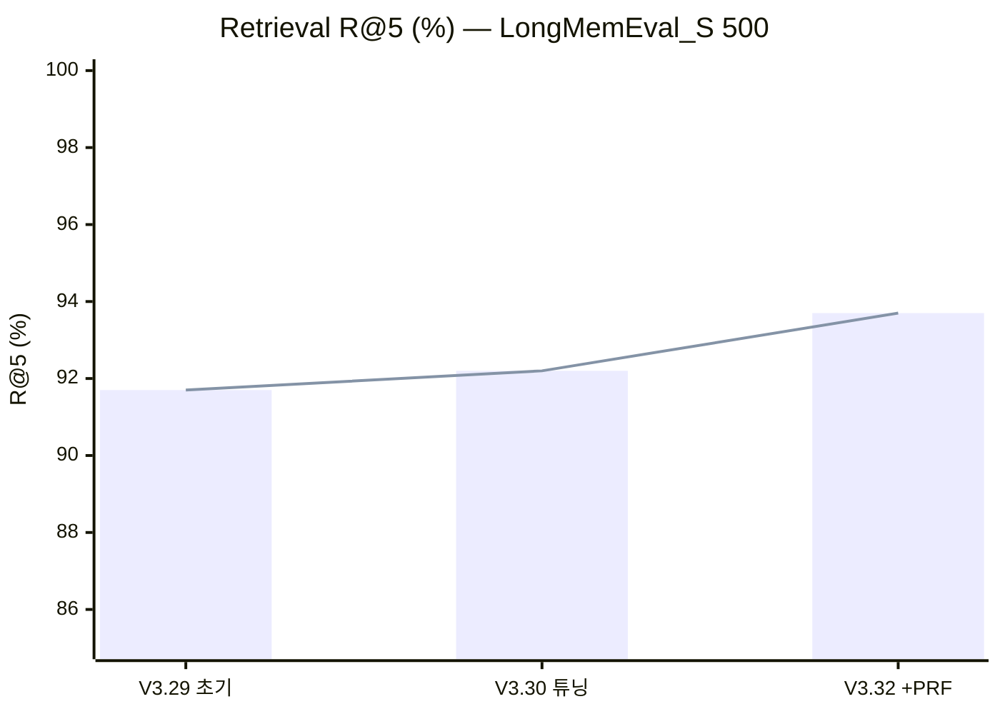
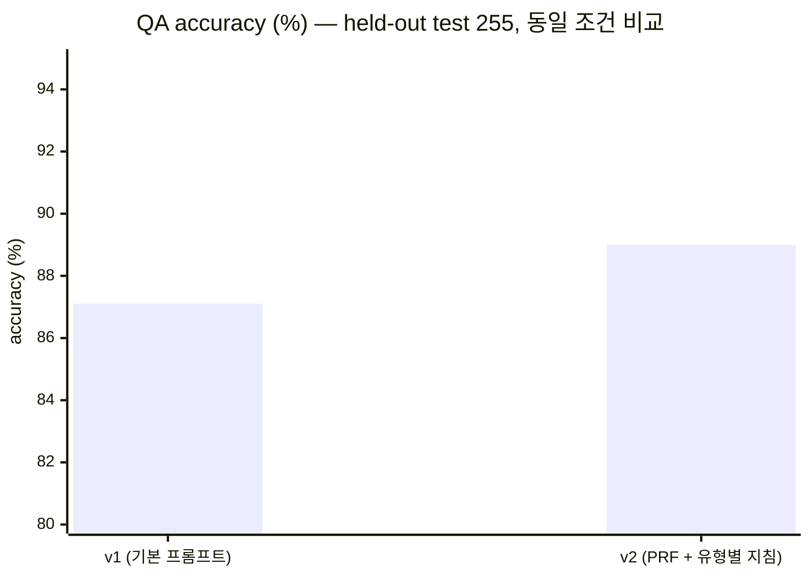
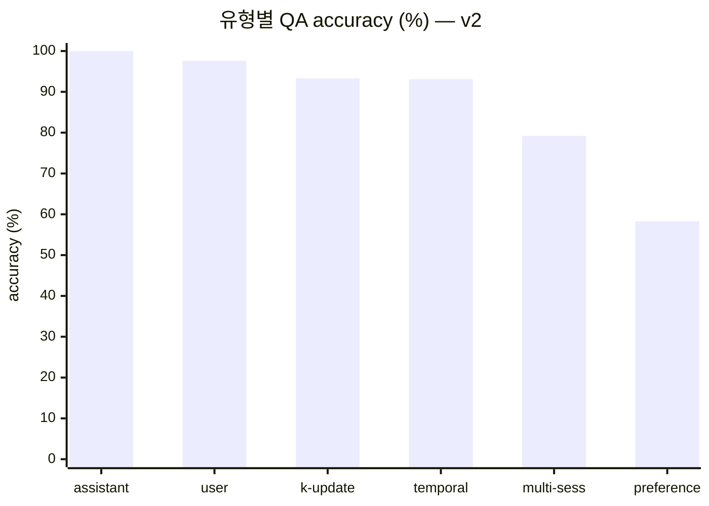
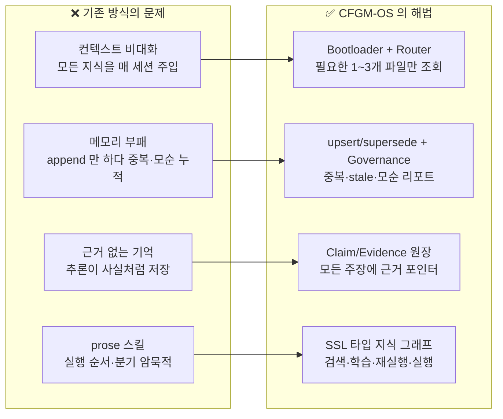
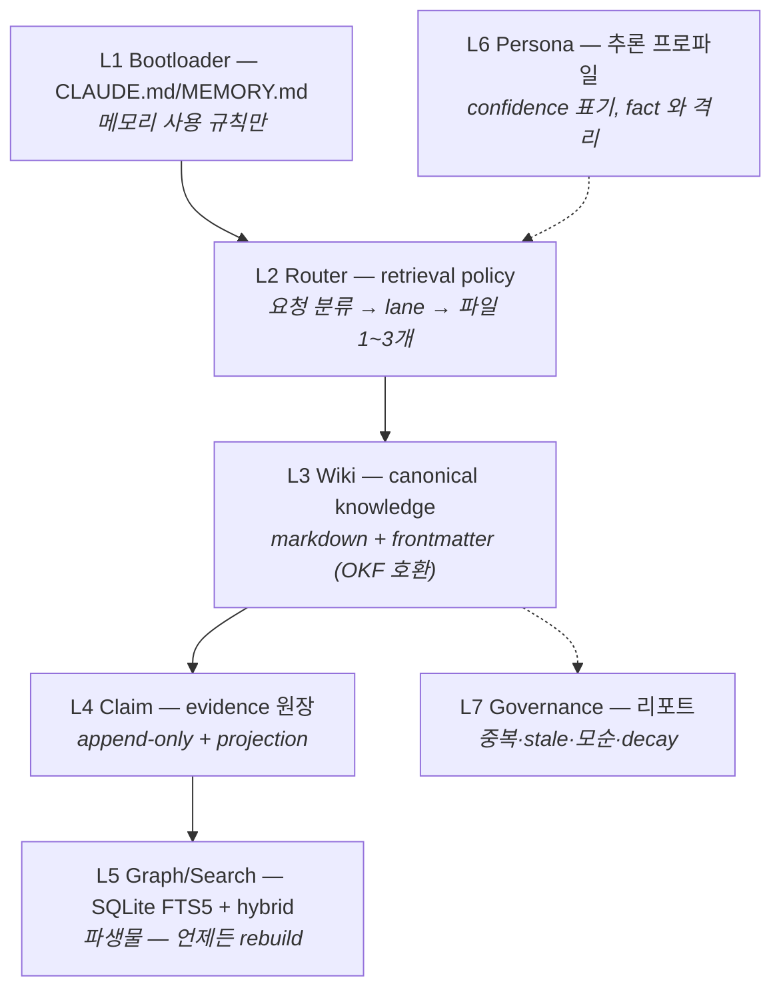
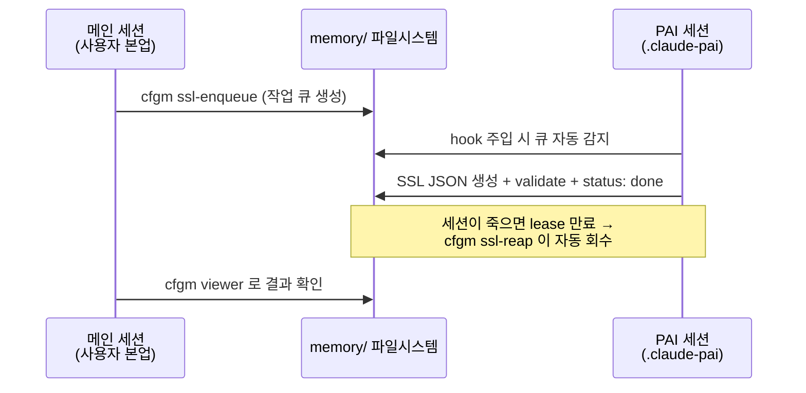

# CFGM-OS — memory-brain

> **Claim-Grounded, Persona-Aware Memory Routing OS**
> AI 에이전트의 기억을 "거대한 텍스트 덤프"가 아니라 **근거 기반 · 라우팅되는 · 실행 가능한 지식 그래프**로 관리하는 오픈소스 메모리 엔진.
> <sub>*An open-source memory engine that manages AI agent memory as an evidence-grounded, routed, executable knowledge graph — not a giant text dump.*</sub>

   

Claude Code · Codex · Gemini CLI 같은 **host CLI 위에서 동작**합니다. MCP 서버도, API 키도, 추가 구독도 요구하지 않습니다 — 인터페이스는 파일과 자연어 명세뿐입니다.
<sub>*Runs on top of host CLIs. No MCP server, no API key, no extra subscription — the only interfaces are files and natural-language specs.*</sub>

---

## 📊 벤치마크 점수 카드 <sub>*Benchmark Scorecard*</sub>

공신력 있는 외부 벤치마크 **[LongMemEval](https://github.com/xiaowu0162/LongMemEval)** (ICLR 2025) 실측. 모든 수치는 [측정 규약](./docs/BENCHMARK.md)을 따르며 아래 재현 커맨드로 검증 가능합니다.
<sub>*All numbers follow the published methodology and are reproducible with the commands below.*</sub>

### 핵심 수치 <sub>*Headline numbers*</sub>

| 트랙 <sub>Track</sub> | 조건 <sub>Setting</sub> | 점수 <sub>Score</sub> |
|---|---|---|
| 🔍 **Retrieval R@5** | held-out test 255, LLM 호출 0회 | **93.2%** |
| 🔍 Retrieval R@10 / MRR | 전체 500 | **96.5%** / 0.928 |
| 🧠 **QA accuracy** | held-out test 255, Sonnet + LLM judge | **89.0%** |

### 버전별 개선 추이 <sub>*Improvement over versions*</sub>





### 질문 유형별 QA (v1 → v2, held-out test) <sub>*QA by question type*</sub>



| 유형 <sub>Type</sub> | v1 | **v2** | Δ |
|---|---|---|---|
| single-session-assistant | 100% | **100%** | — |
| single-session-user | 97.6% | **97.6%** | — |
| knowledge-update | 93.3% | **93.3%** | — |
| temporal-reasoning | 87.5% | **93.1%** | 🔺 **+5.6pp** |
| multi-session | 77.8% | **79.2%** | 🔺 +1.4pp |
| single-session-preference (n=12) | 58.3% | 58.3% | — <sub>소표본 유보</sub> |

### 신뢰성 장치 <sub>*Why you can trust these numbers*</sub>

| ✅ 장치 <sub>Safeguard</sub> | 내용 <sub>Detail</sub> |
|---|---|
| Held-out split | dev 245 (튜닝 전용) / test 255 (확증 1회) — 결정론적 해시 분할, 과적합 차단 |
| 데이터 무결성 | 데이터셋 SHA-256 공개 — 변조·버전 차이 반박 가능 |
| 튜닝 로그 전면 공개 | **기각된 기법까지 기록** (turn-level: dev -3.1pp → 기각) |
| 벤치 과적합 금지 | 정답에서 역산한 상수(hypernym 사전 류) 사용 금지 원칙 |
| 동일 조건 비교 | v1/v2 는 같은 split · 같은 judge 프로토콜로만 비교 |
| 한계 자진 명시 | judge 자체 실행 · 단일 실행 · 소표본 유형 등 [threats to validity](./docs/BENCHMARK.md#7-알려진-한계-threats-to-validity) |

### 재현하기 <sub>*Reproduce*</sub>

```bash
git clone https://github.com/treestar84/memory-brain.git && cd memory-brain && bun install
mkdir -p data/longmemeval && cd data/longmemeval
curl -LO https://huggingface.co/datasets/xiaowu0162/longmemeval-cleaned/resolve/main/longmemeval_s_cleaned.json
shasum -a 256 longmemeval_s_cleaned.json   # docs/BENCHMARK.md 의 SHA-256 과 대조
cd ../.. && bun run bench:lme -- --split test --prf   # retrieval 확증 수치 재현 (LLM 0회)
```

---

## 🧩 왜 만들었나 — 4가지 페인포인트 <sub>*Why: four pain points*</sub>



## 🏛️ 아키텍처 — 7-layer <sub>*Architecture*</sub>



**5대 설계 원칙** ([`docs/RULES.md`](./docs/RULES.md)): ① MCP 미사용 ② LLM SDK 직접 호출 금지 (host 구독 위임 → **사용자 추가 비용 0**) ③ 외부 orchestration 비의존 ④ Production 품질 (테스트 989+ · 커버리지 ≥90%) ⑤ persona/fact 분리 + mutate 는 별도 PAI 세션.

### PAI 세션 — 분리 영속 세션 <sub>*Separate persistent session*</sub>



## 🚀 Quick Start

**Prerequisites**: [Bun](https://bun.sh) ≥ 1.1

```bash
git clone https://github.com/treestar84/memory-brain.git && cd memory-brain
bun install
bun link                          # 전역 `cfgm` 명령 등록 (선택)
cfgm doctor                       # 자가진단 — 부족한 항목과 조치 명령을 알려줌
cfgm rebuild-index --embeddings   # 검색 인덱스 생성 (hybrid 포함)
cfgm search "메모리 라우팅"        # ← 여기까지 60초. 결과가 나오면 정상 동작
```

`cfgm search` 는 `memory/{projects,concepts,decisions}/*.md` 를 즉시 검색합니다 — 이 저장소 자체가 dogfooding 용 실제 메모리를 포함하고 있어 클론 직후에도 결과가 나옵니다. 별도 데이터 시딩이 필요 없습니다.

Claude Code 훅 통합(세션 영구 메모리)까지 원하면 `./install.sh` 를 추가 실행합니다. **훅 없이도 모든 CLI 는 단독 동작합니다.** 제거는 `cfgm uninstall`.

**Claude Code ↔ Codex 동시 지원** <sub>*works with both hosts*</sub> — Claude Code 는 `CLAUDE.md` + hook 자동 주입, Codex CLI 는 세션 시작 시 저장소 루트의 [`AGENTS.md`](./AGENTS.md) 를 직접 읽어 동일한 메모리 규칙을 따릅니다. 두 host 가 같은 `memory/` 디렉토리를 공유하므로 host 를 섞어 써도 데이터는 정합합니다. MCP·특정 host SDK 의존이 없어 다른 CLI 에도 같은 방식(bootloader 파일 + CLI 직접 호출)으로 이식 가능합니다.

## ⌨️ 통합 CLI — `cfgm`

52개 스크립트의 단일 진입점. `cfgm help` 로 그룹별 전체 목록:

```bash
cfgm doctor              # 설치·환경 자가진단 (7항목 + 조치 명령 제시)
cfgm search "<질의>"     # wiki 자연어 검색 — 설치 직후 효능 체감용
cfgm ask "<질의>"        # 검색 + evidence pointer 근거 번들 — host LLM 이 인용 달린 답 생성
cfgm capture --input <파일>  # 세션 노트 → wiki draft 수집 큐 (host-위임, 검토 후 편입)
cfgm stats               # 로컬 사용 통계 (외부 전송 0) — 주간 검색/ask·top 질의
cfgm bench               # 내부 memory quality benchmark
cfgm bench-lme           # LongMemEval 외부 벤치마크
cfgm ssl-status          # SSL normalize 큐 상태 (+stale)
cfgm viewer              # KG-Brain 대시보드 (localhost:4041)
cfgm run --skill <slug>  # SSL 스킬 실행 계획 / --interactive
```

전역 등록 없이 쓰려면 `bun run bin/cfgm.ts <command>`. registry 에 없는 이름도 `bin/cfgm-<name>.ts` 가 존재하면 실행됩니다.

## 🧠 핵심 기능 <sub>*Core features*</sub>

### KG-Brain — SKILL.md → SSL 지식 그래프

`.claude/skills/**` 의 prose 스킬을 Scheduling–Structural–Logical 타입 그래프로 정규화합니다. SKILL.md 가 source-of-truth, SSL JSON 은 파생물입니다.

```bash
cfgm ssl-enqueue     # heuristic 1차 + hole 있는 스킬은 PAI 큐로
cfgm rebuild-index   # wiki + claim + SSL 인덱싱
cfgm ssl-stats       # canonical 사용률 등 지표 (실측: 96%)
cfgm viewer          # 대시보드 — 3-layer 시각화·검색·risk findings
```

### Workflow Learn & Replay + Executable SSL

```bash
cfgm learn --name my-flow --goal "..."               # 세션 워크플로우 → SSL 저장
cfgm replay --query "ssl normalize"                  # Scene DAG 순서 replay plan
cfgm run --skill app-store-screenshots --interactive # SSL JSON 만으로 단계별 실행
```

실행 순서(Scene DAG)·분기(DecisionNode)·사용자 pause(InteractionNode)·성공 기준(EvidenceNode)·위임 규약(ProtocolNode)이 전부 명시적입니다.

### KG Graph + 체인 추론

```bash
cfgm graph-query neighbors <node_id> --relation DELEGATES_TO
cfgm compose                        # DELEGATES_TO 전이 폐포 → COMPOSES + 사이클 감지
cfgm find-chain --goal "..."        # goal → 스킬 체인 발견 (--replay 연동)
```

### Hybrid 검색 + PRF (opt-in)

FTS5 BM25 에 의존성 0 의 결정론적 n-gram 벡터를 융합하고, PRF(pseudo-relevance feedback)로 어휘 단절을 보완합니다. 융합 전략 3종은 전부 실측 근거로 선택됐습니다 ([EXTENDING.md](./docs/EXTENDING.md)). 벡터 없는 인덱스에서는 FTS 로 안전하게 fallback.

### OKF Export

L3 wiki 를 Google [Open Knowledge Format](https://github.com/GoogleCloudPlatform/knowledge-catalog/tree/main/okf) v0.1 번들로 내보냅니다 (wiki 가 truth, OKF 는 어댑터 뒤 파생물): `cfgm okf-export --out dist/okf`

### LongMemEval 풀 QA 트랙 (host-위임)

```bash
cfgm lme-enqueue --split test       # answer job 생성 (PRF retrieval top-k 컨텍스트)
# → host LLM 이 job 처리 (ground truth 미포함 — 누출 차단)
cfgm lme-score --judge-enqueue      # semantic 판정 job 생성 → host 처리
cfgm lme-score --collect            # 공식 지표 (judge accuracy) 집계
```

## 📚 문서 지도 <sub>*Documentation map*</sub>

| 문서 | 내용 |
|---|---|
| [`AGENTS.md`](./AGENTS.md) | Codex 등 non-Claude host 용 bootloader — `CLAUDE.md` 와 동일 규칙 |
| [`docs/BENCHMARK.md`](./docs/BENCHMARK.md) | **측정 규약** — SHA-256·split 정책·튜닝 로그·재현 절차·한계 |
| [`docs/RULES.md`](./docs/RULES.md) | 아키텍처 원칙 5 + 위반 처리 (새 코드 전 필독) |
| [`docs/EXTENDING.md`](./docs/EXTENDING.md) | 확장 seam 8종 — Embedder·fusion·Router·어휘·host-위임 큐 |
| [`memory/SCHEMA.md`](./memory/SCHEMA.md) / [`memory/ROUTER.md`](./memory/ROUTER.md) | 디렉토리 명세 / retrieval policy |
| [`docs/adr/`](./docs/adr/) | Architecture Decision Records |
| [`CHANGELOG.md`](./CHANGELOG.md) | 버전별 변경 + 실측 기록 (퇴행 포함 정직 보고) |

## 🧪 Test

```bash
bun test              # 989+ tests
bun run typecheck
```

## Storage Paths

- 사용자 레벨: `~/.claude-brain/memory-brain/` (또는 `CFGM_HOME`)
- 프로젝트 레벨: `$PROJECT/.memory-brain/` (`CFGM_PROJECT_ROOT` 지정 시)

## License

MIT
