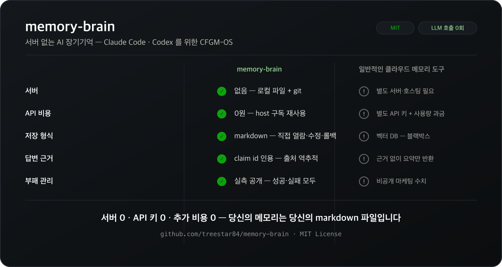
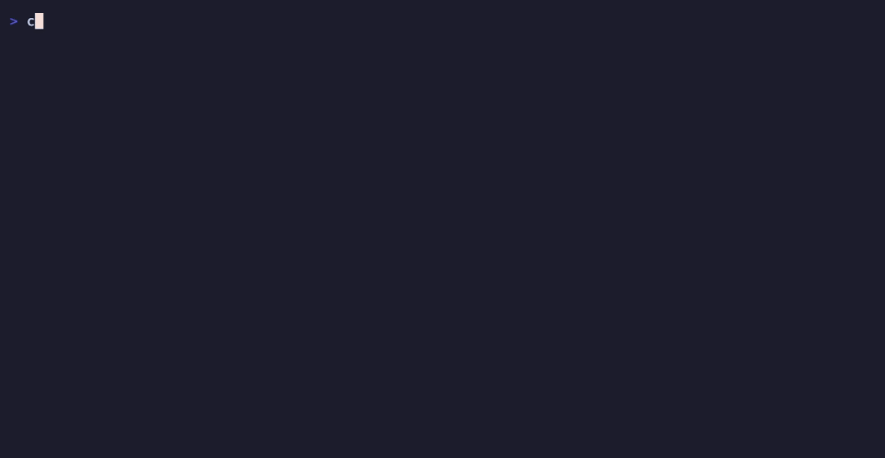

🇺🇸 [English (full technical version)](./README.en.md)

# memory-brain

> **Claude Code, Codex 같은 AI 코딩 CLI를 위한, 서버 없는 장기기억.**
> 세션이 끝나면 사라지던 대화·결정·이유를 markdown 파일로 남겨서, 다음 세션에서도 근거와 함께 다시 꺼내 씁니다.

   



---

## 30초면 감이 옵니다



```
❌ 보통의 새 세션
> 지난주에 고친 그 검색 크래시 버그, 왜 그렇게 고쳤더라?
"이전 대화 기록이 없어 확인할 수 없습니다. 일반적으로는..." (추측 시작)
```

```bash
$ cfgm ask "하이픈 들어간 검색어가 크래시나던 버그 왜 이렇게 고쳤지"
질의: "하이픈 들어간 검색어가 크래시나던 버그 왜 이렇게 고쳤지" — 근거 1건

● decision.fts5-special-char-crash-fix  [decision/active]
  decisions/fts5-special-char-crash-fix.md
  ...KG-Brain" 처럼 하이픈(`-`)이 포함된 실사용 검색어가 SQLite FTS5 의 MATCH...
  claims: cl-fts5-001, cl-fts5-002, cl-fts5-003, cl-fts5-004

위 근거만 사용해 질문에 답하라. 각 주장 끝에 (근거: <pageId> / <claim-id>) 형식의
pointer 를 인용하라. 위 근거로 답할 수 없으면 추측하지 말고 '메모리에 근거 없음'
이라고 답하라. 질문: 하이픈 들어간 검색어가 크래시나던 버그 왜 이렇게 고쳤지
```

> "하이픈처럼 FTS5 쿼리 문법에서 특별한 의미를 갖는 문자가 검색어에 섞이면 NOT 연산자 등으로 잘못 해석돼 쿼리가 깨졌습니다. 그래서 원본 쿼리가 실패하면 정제된 쿼리로, 그래도 안 되면 전체 토큰을 느슨하게 묶은 쿼리로 넘어가는 3단계 폴백을 넣어 절대 크래시하지 않도록 고쳤습니다 **(근거: decision.fts5-special-char-crash-fix / cl-fts5-002, cl-fts5-003)**"

이 답변을 만드는 데 별도 LLM API 호출은 0회입니다 — 이미 쓰고 있는 Claude Code / Codex 구독이 그대로 답을 만듭니다.

---

## 왜 다른가 — 3가지

**1. 서버가 없습니다.** 기억은 `memory/` 폴더 안의 markdown 파일입니다. 클라우드에 안 보내고, 벡터 DB도 없고, API 키도 필요 없습니다. 열어보고 싶으면 그냥 에디터로 엽니다.

**2. 답변에 항상 근거가 붙습니다.** "그거 어디서 나온 정보야?"라고 물으면, 진짜로 파일의 어느 문장인지 (`cl-oss-004` 같은 claim id) 짚어서 답합니다. 근거가 없으면 모델이 추측 대신 "모른다"고 말하도록 지시됩니다.

**3. 기억은 git으로 관리됩니다.** 잘못된 기억은 diff로 리뷰하고, 고치고, 롤백할 수 있습니다. 팀이라면 PR로 기억을 공유할 수도 있습니다 — 벤더 락인 없이요.

<sub>다른 도구들과 다르게, memory-brain 은 "세션이 쌓일수록 검색 품질이 나빠지는 문제(memory rot)"도 직접 실측해서 성공/실패 모두 공개합니다. 자세한 수치는 [`docs/ROT-BENCH.md`](./docs/ROT-BENCH.md) 에 있습니다.</sub>

---

## 설치 — 가장 빠른 방법 (Claude Code 플러그인)

```
/plugin marketplace add treestar84/memory-brain
/plugin install memory-brain@cfgm-os
/memory-brain:setup
```

`/memory-brain:setup` 은 `bun install && bun link` 를 실행하는 1회성 단계입니다. Claude가 실제로 무엇을 실행하는지 보여주고 실행 전에 동의를 구합니다 — 조용히 뒤에서 실행되는 건 없습니다. 이후 슬래시 커맨드로 씁니다:

```
/memory-brain:search <질의>          # 자연어 검색
/memory-brain:ask <질의>             # 검색 + 근거 인용 답변
/memory-brain:doctor                 # 설치 상태 확인
/memory-brain:capture <파일>         # 세션 기록 → 기억 후보로 저장
/memory-brain:stats                  # 내가 얼마나 썼는지 통계
```

### 수동 설치 (다른 CLI 를 쓰거나, 저장소를 직접 살펴보고 싶을 때)

**필요한 것**: [Bun](https://bun.sh) ≥ 1.1

```bash
git clone https://github.com/treestar84/memory-brain.git && cd memory-brain
bun install
bun link
cfgm doctor                       # 설치 상태 자가진단
cfgm rebuild-index --embeddings   # 검색 인덱스 생성
cfgm search "메모리 라우팅"        # ← 여기까지 60초. 결과가 나오면 정상 동작
```

이 저장소 자체가 실제로 쓰고 있는 기억(`memory/`)을 담고 있어서, 클론 직후에도 바로 검색 결과가 나옵니다. Claude Code 와 Codex 를 동시에 쓸 수도 있습니다 — 자세한 내용은 [`AGENTS.md`](./AGENTS.md) 참고.

---

## 자주 쓰는 명령

```bash
cfgm doctor               # 설치·환경 자가진단
cfgm search "<질의>"      # 자연어 검색
cfgm ask "<질의>"         # 검색 + 근거 인용 답변
cfgm capture --input <파일>   # 세션 노트 → 기억 후보 큐
cfgm decay                # 오래되고 안 쓰는 기억 찾기 (삭제 없음, 보관만)
cfgm stats                # 내 사용 통계
cfgm dashboard            # 위키/검색/capture 큐 실시간 대시보드 (localhost:4040, 로컬 전용)
```

전체 명령은 `cfgm help`. 더 깊은 기능(지식그래프, 워크플로우 재실행 등)은 [영문 문서](./README.en.md)의 "Advanced features" 섹션에 정리돼 있습니다.

---

## 얼마나 정확한가 — 벤치마크

외부 공신력 벤치마크 [LongMemEval](https://github.com/xiaowu0162/LongMemEval)(ICLR 2025) 로 실측했고, 측정 방법과 데이터셋 SHA-256 까지 전부 공개합니다.

| 항목 | 조건 | 수치 |
|---|---|---|
| 검색 정확도(R@5) | held-out test 255문항, LLM 호출 0회 | **93.2%** |
| 질문 답변 정확도 | held-out test 255문항 | **89.0%** |

**기각한 시도도 그대로 기록합니다.** 예를 들어 자체 개발한 "메모리 정리" 기법 하나는 실측에서 효과가 없어 폐기했고, 그 과정을 [`CHANGELOG.md`](./CHANGELOG.md) 에 그대로 남겼습니다 — 좋은 결과만 골라 보여주지 않습니다.

자세한 방법론·재현 커맨드·한계는 [`docs/BENCHMARK.md`](./docs/BENCHMARK.md), 메모리 부패 실측은 [`docs/ROT-BENCH.md`](./docs/ROT-BENCH.md) 를 참고하세요.

---

## 다른 메모리 도구와 비교하면

| | memory-brain | agentmemory(25.8K★) | mem0(61.7K★) | Khoj(36.0K★) |
|---|---|---|---|---|
| 서버 | **없음** | 상주 서버+별도 엔진 필수 | API 서비스 | 자체 서버 |
| 외부 의존성 | **없음**(Bun + 패키지 1개) | Rust 엔진 바이너리(일부 비-OSS 라이선스 혼합) | Qdrant/pgvector | 다수 |
| 검색 정확도(R@5, LongMemEval) | 93.2% | 95.2% | 68.5%(다른 데이터셋) | 측정 안 함 |
| 토큰 비용 | **실측 ~184 tokens/질의, $0/년**(LLM 호출 코드 자체가 없음) | ~1,900 tokens/세션, ~$10/년 | 연동 방식마다 다름 | 다양 |

정직하게 말하면 **검색 정확도는 agentmemory보다 2%p 낮습니다** — 아직 못 따라잡은 부분이고 숨기지 않습니다. 대신 "서버·외부 의존성 완전히 0"이라는 건 이 표에 나온 도구 중 memory-brain만 실제로 검증되는 주장입니다(agentmemory도 "의존성 없음"이라 하지만 실제로는 별도 엔진 바이너리가 필수입니다). 9개 도구 전체와의 상세 비교는 [`README.en.md`](./README.en.md) 의 "vs Competitors" 섹션에 있습니다.

---

## 더 알아보기

| 문서 | 내용 |
|---|---|
| [`README.en.md`](./README.en.md) | 아키텍처(7-layer)·설계 원칙·전체 CLI·고급 기능까지 다루는 영문 상세판 |
| [`docs/BENCHMARK.md`](./docs/BENCHMARK.md) | 벤치마크 측정 규약 — 재현 가능하게 |
| [`docs/ROT-BENCH.md`](./docs/ROT-BENCH.md) | 메모리 부패 실측 + 나만의 메모리 도구 측정하기 |
| [`docs/RULES.md`](./docs/RULES.md) | 5대 설계 원칙 (서버 없음, API 키 불요 등) |
| [`AGENTS.md`](./AGENTS.md) | Codex 등 non-Claude host 용 안내 |
| [`CHANGELOG.md`](./CHANGELOG.md) | 버전별 변경 이력 (실패한 시도 포함, 정직하게) |

## Storage Paths

- 사용자 레벨: `~/.claude-brain/memory-brain/` (또는 `CFGM_HOME`)
- 프로젝트 레벨: `$PROJECT/.memory-brain/` (`CFGM_PROJECT_ROOT` 지정 시)

## License

[MIT](./LICENSE)
